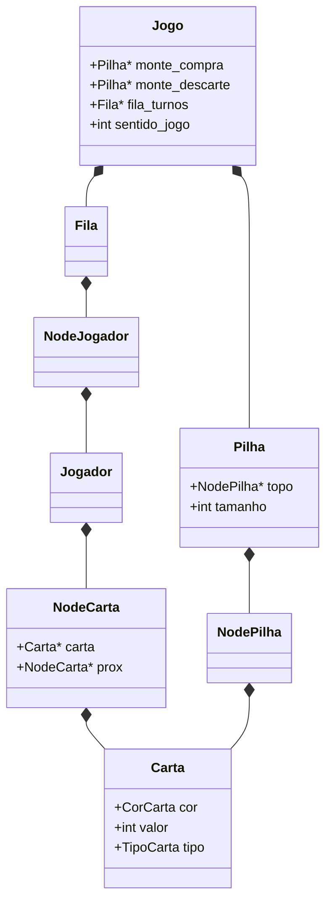
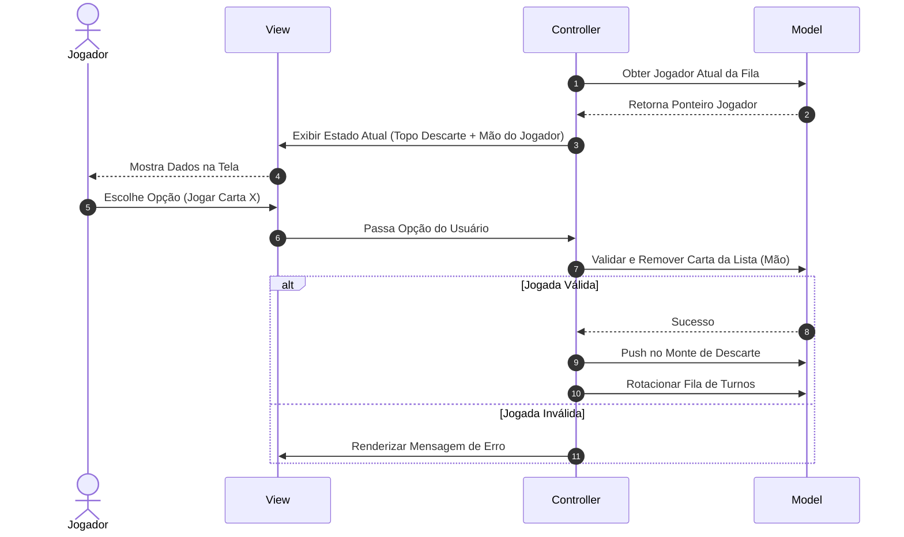

# Especificação do Jogo (UNO Simulador)

## 1. Visão Geral

Este documento descreve as estruturas de dados, regras e arquitetura do projeto **UNO Simulador** implementado em C. O jogo utiliza camadas separadas (MVC) e estruturas dinâmicas (pilhas, filas e lista circular) para modelar os componentes do baralho e a ordem dos turnos.

---

## 2. Arquitetura (MVC)

- **Model (Modelo):** mantém o estado do jogo (baralhos, fila de turnos, mão dos jogadores e variáveis de controle).
- **View (Visão):** responsável por exibir informações no terminal e coletar entradas do usuário.
- **Controller (Controlador):** orquestra a lógica do jogo, validando ações e aplicando regras.

---

## 3. Estruturas de Dados

### 3.1 TAD de Cartas

As cartas são modeladas por uma estrutura em C:

```c
typedef enum { NORMAL, INVERTER, COMPRAR_DOIS, PULAR } TipoCarta;

typedef enum { VERMELHO, VERDE, AZUL, AMARELO } CorCarta;

typedef struct {
    CorCarta cor;
    int valor; // 0 a 9 para normais; -1 para especiais
    TipoCarta tipo;
} Carta;
```

### 3.2 TAD de Pilha (Monte)

A pilha é usada para representar:

- **Monte de Compra**
- **Monte de Descarte**

### 3.3 TAD de Fila (Turnos)

A fila representa a ordem dos jogadores para execução de turnos.

### 3.4 TAD de Lista Circular (Mão do Jogador)

A lista circular mantém as cartas que um jogador possui (mão), permitindo iterações e remoções conforme as jogadas.

---

## 4. Modelo Conceitual

### 4.1 Diagrama (UML) Simplificado



### 4.3 Diagrama de Sequência: Execução de um Turno Padrão



---

## 5. Funcionalidades e Mecânicas do Jogo

### 5.1 Fluxo Geral da Partida

#### Inicialização da partida

O Controller invoca os inicializadores das pilhas e da fila global do jogo. O baralho padrão (composto por cartas numeradas e especiais) é gerado dinamicamente na memória.

#### Criação dos jogadores

O sistema pergunta o número de participantes (mínimo 2, máximo 4) e seus nomes. Para cada jogador, é alocada uma estrutura `Jogador` com sua respectiva lista circular de cartas vazia. Cada jogador é colocado na fila de turnos.

#### Distribuição de cartas

O baralho gerado (Monte de Compra) é embaralhado por um algoritmo de permutação aleatória. Em seguida, 7 cartas são retiradas do Monte de Compra (`pop`) e inseridas na lista circular de cada jogador.

#### Sorteio do primeiro jogador

A cabeça da fila define o início. Uma carta inicial é retirada do Monte de Compra e inserida via `push` no Monte de Descarte para inaugurar a partida.

#### Execução dos turnos

O loop principal roda enquanto nenhum jogador esvaziar sua lista de cartas. A cada iteração:

- O jogador da frente da fila joga uma carta compatível em cor, número ou tipo com a do topo do descarte.
- Caso não possua carta válida, é obrigado a efetuar um `pop` na pilha de compra e inseri-la em sua mão.
  - Se a carta comprada for válida, ele pode jogá-la imediatamente.
  - Se não for válida, passa o turno.

#### Encerramento da partida

No instante em que o tamanho da lista de cartas de um jogador chegar a zero, o loop é finalizado. A View declara o respectivo jogador vencedor e o Controller inicia a limpeza de memória de todas as estruturas.

### 5.2 Cartas e Efeitos Especiais

As cartas são modeladas pela estrutura apresentada na Seção 3.1.

#### Regras de impacto nas estruturas de dados

- **Inverter sentido (INVERTER):** altera a variável de controle `sentido_jogo` no modelo (de 1 para -1, ou vice-versa). Isso afeta a forma como o próximo jogador será escolhido na fila de turnos.

- **Comprar duas (+2):** o Controller localiza o próximo jogador na fila de turnos, executa dois `pop` do Monte de Compra e insere essas cartas na mão do jogador afetado. Em seguida, esse jogador perde o direito de jogar (pula o turno).

- **Pular jogador (PULAR):** o Controller retira o jogador atual da frente da fila, re-enfileira-o no final e, em seguida, realiza a “pulada” do próximo jogador (equivalente a ignorar um ciclo no andamento da fila).

### 5.3 Mecânica de Inversão Detalhada

O controle do fluxo de turnos bidirecional pode ser implementado de duas formas principais respeitando as estruturas.

#### Abordagem via fila modificada

- Em um sentido padrão (horário), ao terminar o turno, o jogador da frente é desenfileirado e inserido no fim da fila.
- No sentido anti-horário, a ordem física da fila pode ser invertida (reconstrução) ou aplicada por uma lógica equivalente (quando não há deque explícito).

#### Abordagem via ponteiros na fila simulada

- Manter uma lista/estrutura de jogadores e usar a fila como ponte para indicar quem é o atual.
- Se o sentido muda, o algoritmo de seleção do próximo nó passa a caminhar no sentido inverso.

---

## 6. Organização de Diretórios do Projeto

O projeto adota uma árvore de diretórios profissional e padronizada para sistemas em C modularizados.

```text
/project
├── src/                    # Arquivos de implementação (.c)
│   ├── main.c              # Ponto de entrada do sistema
│   ├── controller/         # Implementação dos controladores
│   ├── model/              # Implementação dos modelos e regras
│   └── view/               # Implementação da interface CLI
├── include/                # Cabeçalhos globais (.h)
├── docs/                   # Documentação, diagramas e relatórios
├── tests/                  # Testes unitários e de integração
├── Makefile                # Compilação automatizada
└── README.md               # Instruções
```

### Detalhamento das pastas

- `src/`: código dividido por camadas arquiteturais.
- `include/`: assinaturas e definições de structs (`.h`) para evitar acoplamento direto.
- `docs/`: documentação e relatórios.
- `tests/`: testes unitários das estruturas (Pilha, Fila, Lista) sem acionar a interface do jogo.
- `Makefile`: regras de compilação (gcc e flags estritas como `-Wall -Wextra -g`).

---

## 7. Arquivos do Sistema e Suas Funções

Para garantir a modularidade e respeitar o padrão MVC, o código é segmentado nos seguintes arquivos.

- **`main.c`:** função `main()`. Instancia o loop principal e delega ao Controller.
- **`carta.h` / `carta.c`:** TAD `Carta`. Propriedades e funções utilitárias de geração/visualização.
- **`pilha.h` / `pilha.c`:** pilha encadeada dinâmica usada para Monte de Compra e Monte de Descarte.
- **`fila.h` / `fila.c`:** fila dinâmica de ponteiros para jogadores ativos.
- **`lista_circular.h` / `lista_circular.c`:** lista duplamente encadeada circular para a mão do jogador.
- **`jogo.h` / `jogo.c`:** estado global unificado (Model Global).
- **`controller.h` / `controller.c`:** validação de jogadas e aplicação das regras.
- **`view.h` / `view.c`:** exibição no terminal e entrada limpa do usuário.

---

## 8. Requisitos de Software

### 8.1 Requisitos Funcionais (RF)

- **RF-01:** inicialização do sistema (instanciar estruturas vazias sem falhas de segmentação).
- **RF-02:** gerenciamento de jogadores (aceitar 2 a 4 jogadores com nomes).
- **RF-03:** embaralhamento e distribuição (gerar baralho dinâmico, embaralhar e distribuir 7 cartas por jogador no início).
- **RF-04:** exibição do menu do turno (jogador atual, cartas enumeradas da mão, topo do descarte).
- **RF-05:** validação de jogada (jogar apenas carta compatível em cor, valor ou tipo com o topo do descarte).
- **RF-06:** compra automática (comprar quando necessário e integrar carta na mão).
- **RF-07:** efeito inverter (ordem dos turnos subsequentes no sentido contrário).
- **RF-08:** Execução do Efeito Pular: ao jogar a carta **"Pular"**, o jogador imediatamente subsequente da fila deve ter seu turno ignorado.
- **RF-09:** Execução do Efeito Comprar Duas (+2): ao jogar a carta **"+2"**, o jogador seguinte na fila deve receber automaticamente **duas cartas do monte de compra** e perder o turno de jogar.
- **RF-10:** Tratamento de Baralho Vazio: se o monte de compra esvaziar durante a partida, o sistema deve recolher todas as cartas do descarte (exceto a do topo atual), reinseri-las no monte de compra e **re-embaralhar** dinamicamente.
- **RF-11:** Verification de Vitória: o jogo deve monitorar o tamanho da lista de cartas de cada jogador e encerrar a partida imediatamente assim que a lista de algum jogador atingir o tamanho zero, declarando-o campeão.

### 8.2 Requisitos Não Funcionais (RNF)

- **RNF-01:** Modularidade Estrita: o código C deve ser totalmente fatiado em arquivos `.h` e `.c` específicos para cada estrutura e camada, proibindo funções gigantescas ou arquivos com múltiplos propósitos.
- **RNF-02:** Gerenciamento Absoluto de Memória: toda memória alocada por `malloc`, `calloc` ou `realloc` deve obrigatoriamente passar por um processo de liberação explícita através da rotina `free` antes da finalização do programa.
- **RNF-03:** Legibilidade e Padrão de Código: o código fonte deve seguir uma padronização consistente de nomenclatura (`snake_case`) e documentação interna de ponteiros.
- **RNF-04:** Tratamento de Ponteiros Nulos: todas as funções que recebem ou geram ponteiros devem verificar previamente se o ponteiro é nulo (`NULL`) para evitar travamentos abruptos do software (Segmentation Fault).
- **RNF-05:** Portabilidade POSIX: o código deve compilar e rodar perfeitamente em ambientes baseados em Unix/Linux usando o compilador GCC padrão, sem dependência de bibliotecas proprietárias de um único S.O. (como `<conio.h>`).
- **RNF-06:** Robustez de Entrada: o sistema não deve quebrar caso o usuário digite um caractere textual quando o programa estiver esperando um número inteiro no menu.

---

## 9. Casos de Uso Detalhados

### UC-01: Iniciar Partida

**Atores:** Usuário/Jogadores.

**Pré-condições:** Programa executado com sucesso através do terminal.

**Fluxo Principal:**

1. O programa solicita o número de jogadores.
2. O usuário insere a quantidade desejada (ex: 3).
3. O sistema solicita o nome de cada participante consecutivamente.
4. O sistema gera o baralho na Pilha de Compra, embaralha, aloca as Listas Circulares de cada um e insere 7 cartas por jogador.
5. O primeiro jogador é posicionado no topo da fila de controle e a partida começa.

### UC-02: Comprar Carta

**Atores:** Jogador Atual.

**Pré-condições:** Ser o turno do respectivo jogador e ele escolher a opção "Comprar".

**Fluxo Principal:**

1. O jogador solicita a compra de uma carta.
2. O Controller verifica se a Pilha de Compra está vazia (se sim, aciona a reciclagem do descarte via RF-10).
3. O Controller faz um `pop` na Pilha de Compra.
4. O sistema faz um `inserir_carta` na Lista Circular do jogador atual.
5. A View mostra a carta obtida. O turno passa para o próximo elemento da fila.

### UC-03: Jogar Carta

**Atores:** Jogador Atual.

**Pré-condições:** O jogador deve selecionar o índice de uma carta válida de sua mão.

**Fluxo Principal:**

1. O jogador escolhe o índice correspondente à carta que deseja descartar.
2. O Controller compara a carta escolhida com a carta que está no topo da Pilha de Descarte.
3. Sendo válida em cor, valor ou tipo, o Controller remove a carta da Lista Circular do jogador via `remover_carta`.
4. O Controller insere a carta removida na Pilha de Descarte através da função `push`.
5. O sistema verifica se o jogador possui 0 cartas na lista (se sim, vai para o UC-06).
6. O fluxo passa para o próximo jogador da fila.

### UC-04: Inverter Sentido

**Atores:** Sistema / Jogador Atual.

**Pré-condições:** O jogador atual realiza a jogada válida de uma carta do tipo INVERTER.

**Fluxo Principal:**

1. A carta INVERTER é validada e empilhada no descarte.
2. O Controller captura o modificador e inverte o sinal do passo do fluxo de turnos (`sentido_jogo = -sentido_jogo`).
3. A fila reajusta a lógica de quem será o próximo jogador ativo com base no novo sentido de rotação.

### UC-05: Pular Jogador

**Atores:** Sistema / Jogador Atual.

**Pré-condições:** O jogador atual realiza a jogada válida de uma carta do tipo PULAR.

**Fluxo Principal:**

1. A carta PULAR é validada e empilhada no descarte.
2. O Controller avança o ponteiro da fila de turnos uma vez a mais do que o passo convencional de encerramento de rodada.
3. O jogador que seria o próximo é movido para o fim da fila sem interagir com o menu, e o turno subsequente é aberto imediatamente.

### UC-06: Encerrar Partida

**Atores:** Sistema.

**Pré-condições:** A quantidade de nós da Lista Circular do jogador atual atinge o valor zero após um descarte.

**Fluxo Principal:**

1. O loop principal do jogo detecta a condição de parada.
2. O Controller interrompe a entrada de dados.
3. A View exibe uma interface de comemoração informando o nome do jogador vencedor.
4. O Controller chama as funções `liberar_pilha` (compra e descarte), `liberar_fila` (jogadores) e limpa a memória de cada nó das listas circulares restantes de forma iterativa.
5. O programa encerra retornando o código de sucesso 0.
